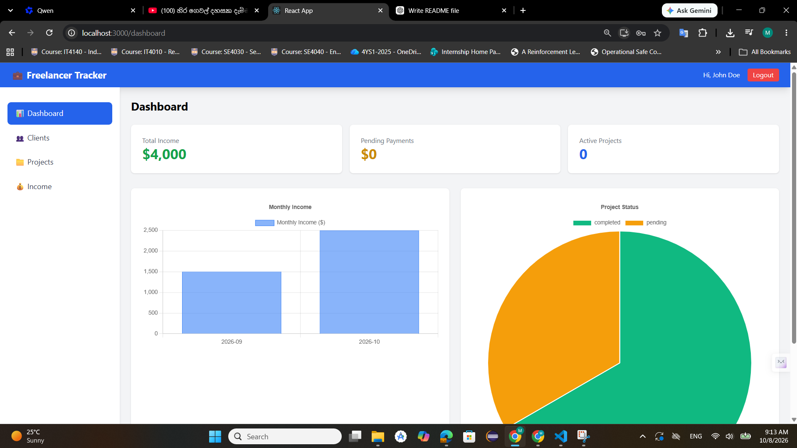
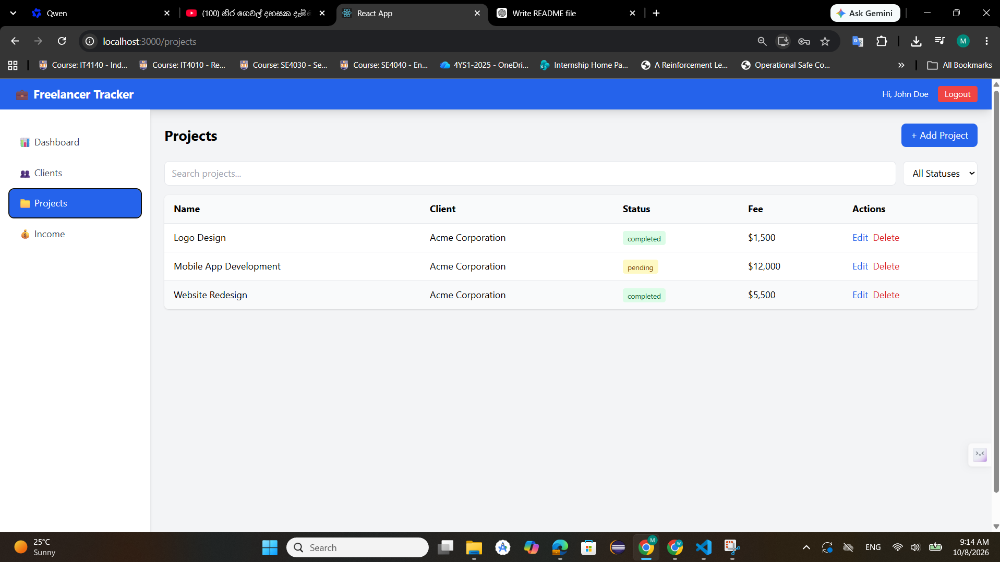
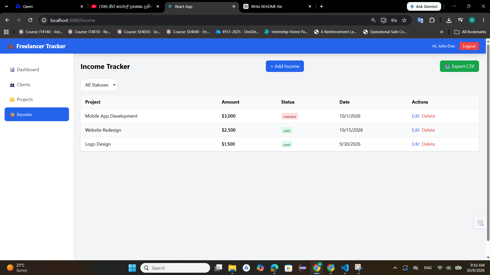

# 💼 Freelancer Project & Income Tracker

A full-stack web application designed to help freelancers efficiently manage their **clients, projects, payments, and overall income** through a centralized and user-friendly dashboard.

The application provides secure authentication, complete client and project management, income tracking, advanced search and filtering, CSV report export, and responsive layouts for both desktop and mobile devices.

---

## 🚀 Features

### 🔐 User Authentication

* Secure user registration and login
* JWT-based authentication
* Password hashing using bcrypt.js
* Protected application routes
* Session-based authentication flow

### 📊 Dashboard

* Overview of active projects
* Total income summary
* Pending payment overview
* Interactive financial and project charts
* Visual representation of income data using Chart.js
* Quick access to important project and financial information

### 👥 Client Management

Complete CRUD functionality for managing clients:

* Add new clients
* View client details
* Edit existing client information
* Delete clients
* Associate clients with projects
* Form validation and error handling

### 📁 Project Management

Manage and monitor freelance projects from one place:

* Create new projects
* Assign projects to clients
* Edit project information
* Delete projects
* Track project status:

  * 🟡 Pending
  * 🔵 Active
  * 🟢 Completed
  * 🔴 Cancelled
* Track project fees
* Track project start and completion dates

### 💰 Income Tracking

Keep track of freelance payments and earnings:

* Add income/payment records
* Track payment status:

  * 🟢 Paid
  * 🟡 Pending
  * 🔴 Overdue
* Record payment dates
* Associate payments with projects
* View income history
* Export income records as CSV

### 🔎 Search & Filtering

* Search projects by name
* Filter projects by status
* Filter income records by payment status
* Quickly locate specific projects and payments

### ✅ Form Validation

* Client-side validation
* Server-side validation
* User-friendly validation messages
* Toast notifications for successful and failed operations
* Error handling for API requests

### 📱 Responsive Design

The application is designed to work across different screen sizes.

* Desktop sidebar navigation
* Mobile bottom navigation
* Responsive tables
* Responsive dashboard
* Mobile-friendly forms and components
* Adaptive layouts for different screen sizes

---

## ⭐ Optional Features

The project also includes additional features to improve usability and performance:

* 📄 **Pagination** — Paginated project and income records
* 📥 **CSV Export** — Export income reports into CSV format
* 📱 **Mobile Navigation** — Dedicated bottom navigation for mobile devices

---

## 🛠️ Technologies Used

| Layer                 | Technology                              |
| --------------------- | --------------------------------------- |
| **Frontend**          | React.js, Tailwind CSS v3, React Router |
| **Charts**            | Chart.js                                |
| **HTTP Client**       | Axios                                   |
| **Notifications**     | React Hot Toast                         |
| **Backend**           | Node.js, Express.js                     |
| **Database**          | MongoDB, Mongoose                       |
| **Authentication**    | JWT                                     |
| **Password Security** | bcrypt.js                               |
| **Version Control**   | Git, GitHub                             |

---

## 🏗️ Project Architecture

```text
freelancer-tracker/
│
├── backend/
│   ├── controllers/
│   ├── middleware/
│   ├── models/
│   ├── routes/
│   ├── config/
│   ├── .env
│   ├── server.js
│   └── package.json
│
├── frontend/
│   ├── public/
│   ├── src/
│   │   ├── components/
│   │   ├── pages/
│   │   ├── services/
│   │   ├── context/
│   │   └── App.js
│   ├── package.json
│   └── ...
│
├── screenshots/
│   ├── dashboard.png
│   ├── projects.png
│   └── income.png
│
└── README.md
```

> The exact folder structure may vary depending on the final implementation.

---

# ⚙️ Setup Instructions

## 📋 Prerequisites

Before running the application, make sure the following are installed:

* **Node.js** v16 or higher
* **npm**
* **MongoDB** locally or a **MongoDB Atlas** database
* **Git**

You can verify Node.js and npm using:

```bash
node --version
npm --version
```

---

## 📥 1. Clone the Repository

Clone the repository from GitHub:

```bash
git clone https://github.com/YOUR_GITHUB_USERNAME/freelancer-tracker.git
cd freelancer-tracker
```

Replace `YOUR_GITHUB_USERNAME` with your GitHub username.

---

## 🖥️ 2. Backend Setup

Navigate to the backend directory:

```bash
cd backend
```

Install the required dependencies:

```bash
npm install
```

### Create the Environment File

Create a `.env` file inside the `backend/` directory:

```env
PORT=5000
MONGO_URI=mongodb://localhost:27017/freelancer-tracker
JWT_SECRET=your_super_secret_key
```

### Environment Variables

| Variable     | Description                            |
| ------------ | -------------------------------------- |
| `PORT`       | Port used by the Express backend       |
| `MONGO_URI`  | MongoDB database connection string     |
| `JWT_SECRET` | Secret key used for JWT authentication |

> **Important:** Never commit your real `.env` file or JWT secret to GitHub.

### Start the Backend

```bash
npm run dev
```

The backend API will run at:

```text
http://localhost:5000
```

---

## 🌐 3. Frontend Setup

Open a **new terminal** and navigate to the frontend:

```bash
cd frontend
```

Install dependencies:

```bash
npm install
```

Start the React development server:

```bash
npm start
```

The frontend will be available at:

```text
http://localhost:3000
```

---

## 🌍 4. Access the Application

Once both servers are running:

| Service        | URL                                          |
| -------------- | -------------------------------------------- |
| 🌐 Frontend    | http://localhost:3000                        |
| ⚙️ Backend API | http://localhost:5000                        |
| 🍃 MongoDB     | mongodb://localhost:27017/freelancer-tracker |

Open the frontend URL in your browser:

```text
http://localhost:3000
```

---

# 📸 Application Screenshots

Screenshots are included to demonstrate the main functionality and responsive user interface.

## 📊 Dashboard

The dashboard provides a centralized overview of projects, income, and pending payments with interactive charts.



---

## 📁 Projects

The Projects page allows users to manage projects, assign clients, track project status, and use search and filtering functionality.



---

## 💰 Income

The Income page allows users to manage payment records, monitor payment statuses, and export income information as CSV.



---

# 🎥 Demo Video

A complete application demonstration is available through the project demo video.

The demonstration covers:

* User registration and login
* Client management
* Project management
* Search and filtering
* Income management
* CSV export
* Dashboard analytics
* Responsive mobile navigation

### ▶️ Demo Video

**Google Drive:**

> Add your Google Drive video link here.

### 🔗 How to Share the Demo

The Google Drive video should have the following sharing configuration:

```text
General Access: Anyone with the link
Role: Viewer
```

This allows reviewers to watch the demonstration without requiring additional access permissions.

---

# 🎬 Demo Video Script

The following flow can be used for a **3–5 minute project demonstration**.

### ⏱️ 0:00 – 0:30 — GitHub Repository

* Open the GitHub repository.
* Briefly show the project structure.
* Scroll through the main frontend and backend folders.
* Highlight the technologies used.

### ⏱️ 0:30 – 1:00 — Authentication

* Open the application.
* Show the Login page.
* Navigate to Register.
* Create a new user account.
* Log into the application.

### ⏱️ 1:00 – 1:30 — Client Management

Navigate to the **Clients** page.

Demonstrate:

1. Add a new client.
2. Display the client.
3. Edit the client.
4. Delete the client.

### ⏱️ 1:30 – 2:30 — Project Management

Navigate to the **Projects** page.

Demonstrate:

1. Add a new project.
2. Select/link the client.
3. Set the project status.
4. Display the project.
5. Search for a project.
6. Filter projects by status.

### ⏱️ 2:30 – 3:30 — Income Management

Navigate to the **Income** page.

Demonstrate:

1. Add an income record.
2. Select the payment status.
3. Display the income record.
4. Filter income records.
5. Click **Export CSV**.
6. Download the generated CSV report.

### ⏱️ 3:30 – 4:00 — Dashboard

Return to the **Dashboard**.

Explain:

* Total income
* Active projects
* Pending payments
* Project statistics
* Income charts
* Financial overview

### ⏱️ 4:00 – 4:30 — Responsive Design

Resize the browser window to demonstrate the responsive interface.

Show:

* Mobile layout
* Mobile bottom navigation
* Responsive dashboard
* Responsive tables

### ⏱️ 4:30 – 5:00 — Conclusion

Briefly summarize the project and its main features.

End the demonstration with a short thank-you message.

---

# 📂 Screenshots Setup

To add application screenshots to the repository:

### 1. Create the screenshots folder

From the project root:

```bash
mkdir screenshots
```

### 2. Capture the following screens

Take clear screenshots of:

* Dashboard
* Projects page
* Income page

### 3. Save them using these names

```text
screenshots/
├── dashboard.png
├── projects.png
└── income.png
```

These images will automatically appear in this README through the Markdown image references above.

---

# 🔒 Security Considerations

The application includes several security mechanisms:

* JWT-based authentication
* Password hashing with bcrypt.js
* Protected API routes
* Environment variables for sensitive configuration
* Server-side input validation
* Client-side input validation
* Controlled authentication flow

Sensitive configuration such as database credentials and JWT secrets should always be stored in environment variables.

---

# 🧪 Testing the Application

Before creating the final release, verify the following functionality:

### Authentication

* [ ] User registration works
* [ ] User login works
* [ ] Invalid credentials are rejected
* [ ] Protected routes require authentication

### Clients

* [ ] Create client
* [ ] View clients
* [ ] Edit client
* [ ] Delete client

### Projects

* [ ] Create project
* [ ] Assign client
* [ ] Edit project
* [ ] Delete project
* [ ] Search projects
* [ ] Filter by project status

### Income

* [ ] Create income record
* [ ] Edit income record
* [ ] Delete income record
* [ ] Filter by payment status
* [ ] Export CSV

### Dashboard

* [ ] Statistics display correctly
* [ ] Charts display correctly
* [ ] Data updates after changes

### Responsive Design

* [ ] Desktop layout
* [ ] Tablet layout
* [ ] Mobile layout
* [ ] Mobile navigation

---

# 🌿 Git Workflow

The project uses Git for version control and feature-based development.

A typical workflow is:

```text
feature branch
      │
      ▼
     dev
      │
      ▼
    main
```

Before merging a feature branch, make sure the latest changes from `dev` are available locally and the application has been tested.

---

# 🚀 Final Git Merge & Push

After completing the README and screenshots, use the following workflow.

## 1. Commit README and Screenshots

```bash
git add README.md screenshots/
git commit -m "docs: add comprehensive README and application screenshots"
```

---

## 2. Merge Feature Branch into `dev`

Switch to the development branch:

```bash
git checkout dev
```

Merge the feature branch:

```bash
git merge feature/optional-polish
```

---

## 3. Merge `dev` into `main`

Switch to the main branch:

```bash
git checkout main
```

Merge the development branch:

```bash
git merge dev
```

---

## 4. Push Changes to GitHub

Push the updated `main` branch:

```bash
git push origin main
```

Push the updated `dev` branch:

```bash
git push origin dev
```

---

# 👤 Author

### A.G.L. Migara Wijesinghe

**BSc (Hons) Information Technology — Software Engineering**

Interested in full-stack software development, modern web technologies, and building practical software solutions.

---

# 📌 Project Summary

**Freelancer Project & Income Tracker** is a full-stack MERN-style web application that combines project management, client management, income tracking, authentication, reporting, and data visualization into a single platform.

The project demonstrates practical implementation of:

* Full-stack web development
* RESTful API development
* MongoDB database integration
* Authentication and authorization
* CRUD operations
* Data visualization
* Search and filtering
* CSV report generation
* Responsive UI development
* Git-based version control

---

## ⭐ Future Improvements

Potential future enhancements include:

* Email notifications for overdue payments
* Automated payment reminders
* Advanced financial analytics
* PDF invoice generation
* Freelancer expense tracking
* Multiple currency support
* Cloud deployment
* Role-based access control
* Dark mode
* Automated database backups

---

## 📄 License

This project was developed for educational and software development purposes.

---

<p align="center">
  💼 <strong>Freelancer Project & Income Tracker</strong><br>
  Built with React, Node.js, Express.js and MongoDB
</p>
